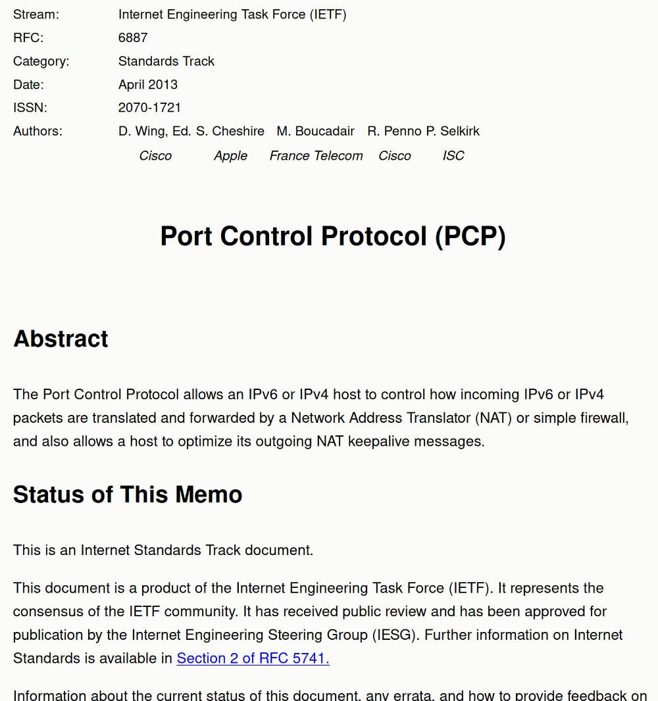

# rfcmei

This tool parses RFC documents, which (prior to RFC 8650) are typically
published in a plain-text ASCII format, such that a richer HTML document with
more markup information can be produced and decorated using CSS.

Here is an example of [RFC 6887](https://www.rfc-editor.org/rfc/rfc6887) after
it is prettified by the tool ([click here](https://hch12907.dev/6887.html) if you
want to check out the prettified HTML instead):



Please understand that the tool is making up new markup information on a best-effort
basis (the original RFC documents, in plain text, obviously contain very little
markup information). **It can produce erroneous results.**

The tool may also fail to parse earlier RFC documents (especially the 3-digit ones),
due to format differences.

## Usage

```bash
# Building the program
# (Currently, nightly Rust is required because of let-chains.)
cargo +nightly build --release

# Using it (requires the original RFC document to be in "HTMLized" format)
curl "https://www.rfc-editor.org/rfc/rfcXXXX.html" >/path/to/rfc.html
cargo run --release -- /path/to/rfc.html >prettified.html
```

## License

This tool is GPLv3-licensed.
