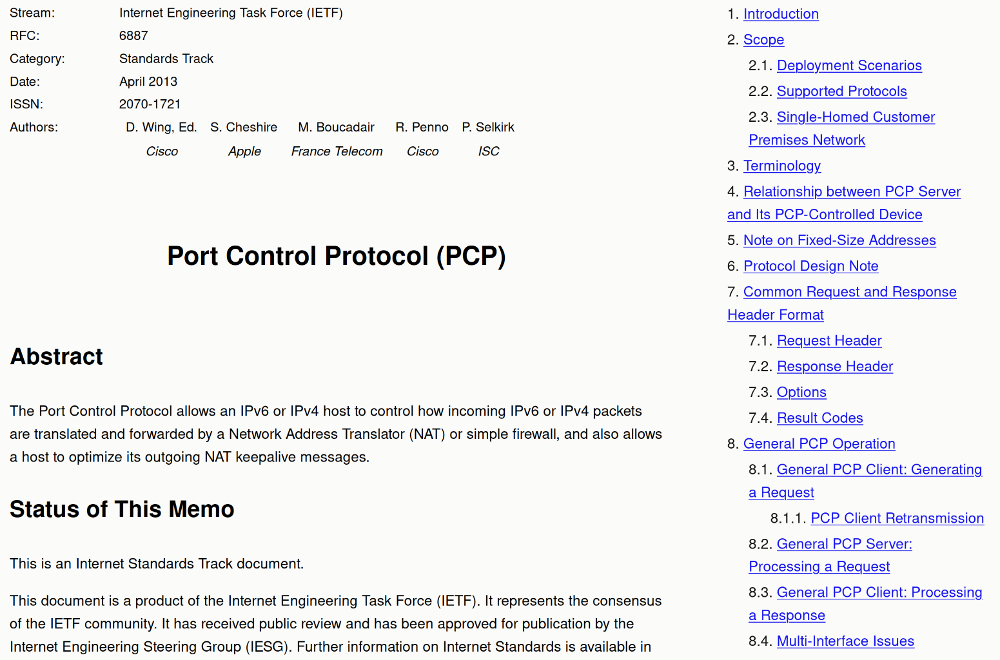

# rfcmei

This tool prettifies RFC documents, which are typically (prior to RFC 8xxx)
published in a plain-text ASCII format, into a richer HTML document which can
then decorated with CSS.

Here is an example of [RFC 6887](https://www.rfc-editor.org/rfc/rfc6887) after
it is prettified by the tool:



Please understand that the tool is making up new markup information on a best-effort
basis (the original RFC documents, in plain text, obviously do not contain any
markup information). **It can produce erroneous results.**

## Usage

```bash
# Building the program
cargo build --release

# Using it (requires the original RFC document to be in "HTMLized" format)
cargo run --release -- /path/to/rfc.html >prettified.html
```

## License

This tool is GPLv3-licensed.
